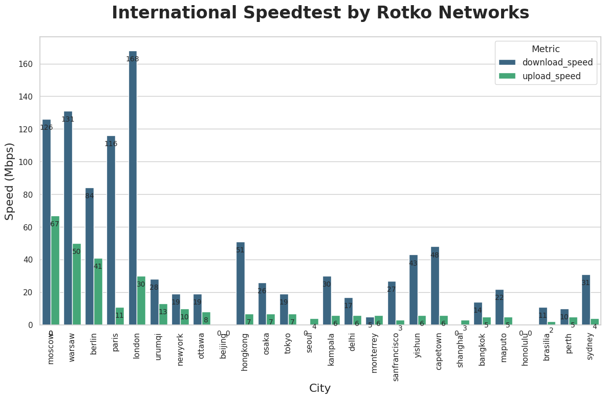
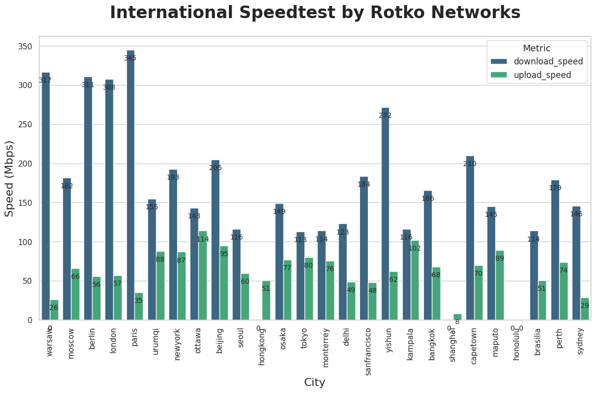
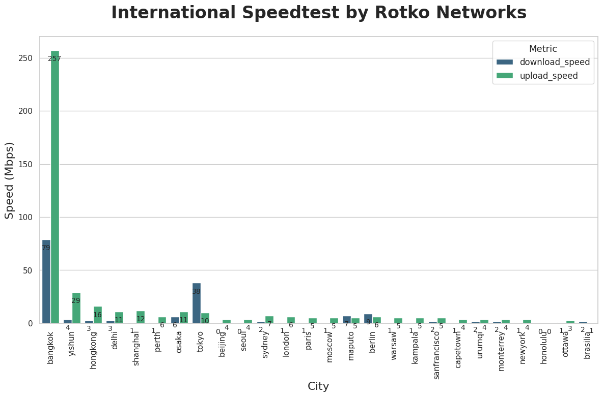
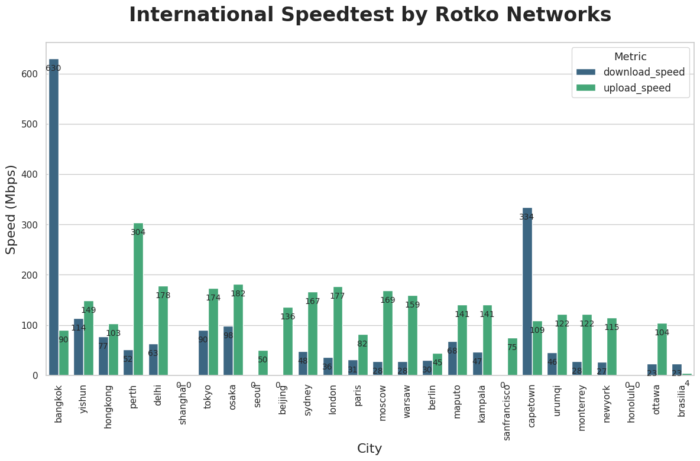

# Single stream vs. 32 streams

test taken using [speedtest-go](https://github.com/showwin/speedtest-go) / [intspeed](https://github.com/rotkonetworks/intspeed)

## hetzner rack 1gbits/1gbits helsinki uplink
```python3 intspeed.py test -t 1 && python3 intspeed.py draw```

```python3 intspeed.py test -t 32 && python3 intspeed.py draw```


## bangkok kirz(TRUE) 1gbits/1gbits international dedicated uplink
```python3 intspeed.py test -t 1 && python3 intspeed.py draw```

```python3 intspeed.py test -t 32 && python3 intspeed.py draw```


## tracert

### from helsinki to bkk
```
8226 ◯ : traceroute rpc.rotko.net                                                                                                    [~]
traceroute to rpc.rotko.net (27.131.160.109), 30 hops max, 60 byte packets
 1  _gateway (192.168.70.1)  0.231 ms  0.343 ms  0.418 ms
 2  static.65.235.216.95.clients.your-server.de (95.216.235.65)  1.014 ms  4.332 ms  4.284 ms
 3  core32.hel1.hetzner.com (213.239.252.53)  1.138 ms core31.hel1.hetzner.com (213.239.252.49)  1.048 ms core32.hel1.hetzner.com (213.239.252.53)  1.143 ms
 4  juniper4.dc1.hel1.hetzner.com (213.239.224.37)  1.287 ms  1.156 ms  1.037 ms
 5  core7.lon.hetzner.com (213.239.254.74)  39.119 ms  39.197 ms  38.831 ms
 6  * * *
 7  * * *
 8  i-1005.sgpl-core03.telstraglobal.net (202.84.143.157)  210.317 ms * *
 9  202.84.244.41 (202.84.244.41)  197.484 ms  197.736 ms  195.512 ms
10  unknown.telstraglobal.net (210.57.68.30)  193.105 ms  194.252 ms unknown.telstraglobal.net (210.57.38.145)  213.392 ms
11  TIG-Net247-147.trueintergateway.com (113.21.247.147)  234.926 ms  228.819 ms  229.109 ms
12  TIG-Net247-147.trueintergateway.com (113.21.247.147)  228.979 ms  239.395 ms  239.791 ms
13  TIG-Net28-190.trueintergateway.com (122.144.28.190)  239.319 ms  231.796 ms  233.441 ms
14  27.131.128.194 (27.131.128.194)  239.225 ms  235.535 ms  240.295 ms
15  27.131.128.74 (27.131.128.74)  235.903 ms  231.379 ms  238.501 ms
16  27.131.160.109 (27.131.160.109)  225.146 ms  223.853 ms  211.940 ms
```

### from bkk to helsinki
```
2056 ± traceroute 95.216.235.72                                                                                       [218d10h46m] ✖ ✹ ✭
traceroute to 95.216.235.72 (95.216.235.72), 30 hops max, 60 byte packets
 1  _gateway (192.168.69.1)  0.128 ms  0.122 ms  0.111 ms
 2  27.131.160.105 (27.131.160.105)  0.807 ms  0.994 ms  1.130 ms
 3  27.131.128.65 (27.131.128.65)  0.349 ms  0.326 ms  0.356 ms
 4  27.131.128.195 (27.131.128.195)  0.353 ms 27.131.128.196 (27.131.128.196)  0.258 ms  0.295 ms
 5  27.131.128.196 (27.131.128.196)  0.486 ms  0.438 ms  0.489 ms
 6  TIG-Net245-21.trueintergateway.com (113.21.245.21)  28.501 ms TIG-Net241-189.trueintergateway.com (113.21.241.189)  26.641 ms SG-ICR-GS2-241-197.trueintergateway.com (113.21.241.197)  25.717 ms
 7  TIG-Net241-189.trueintergateway.com (113.21.241.189)  26.859 ms TIG-Net245-21.trueintergateway.com (113.21.245.21)  27.466 ms  27.844 ms
 8  TIG-Net245-21.trueintergateway.com (113.21.245.21)  28.273 ms * TIG-Net241-189.trueintergateway.com (113.21.241.189)  26.882 ms
 9  * * *
10  * * *
11  port-channel14.core2.ams1.he.net (184.105.81.110)  186.778 ms * *
12  port-channel1.core1.ams1.he.net (184.104.198.118)  178.058 ms port-channel14.core2.ams1.he.net (184.105.81.110)  175.859 ms  179.160 ms
13  * * *
14  * core31.hel1.hetzner.com (213.239.224.38)  238.356 ms core32.hel1.hetzner.com (213.239.224.26)  228.517 ms
15  core32.hel1.hetzner.com (213.239.224.26)  233.128 ms core31.hel1.hetzner.com (213.239.224.38)  237.732 ms  239.248 ms
16  ex9k1.dc1.hel1.hetzner.com (213.239.252.54)  236.816 ms static.72.235.216.95.clients.your-server.de (95.216.235.72)  237.489 ms  237.808 ms
```
